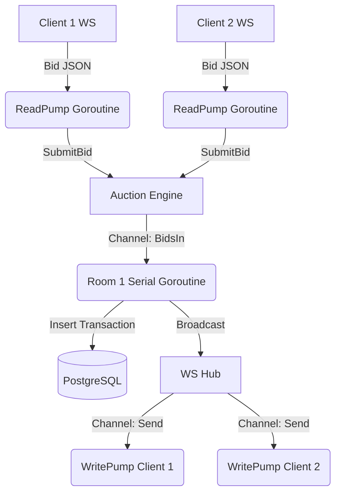
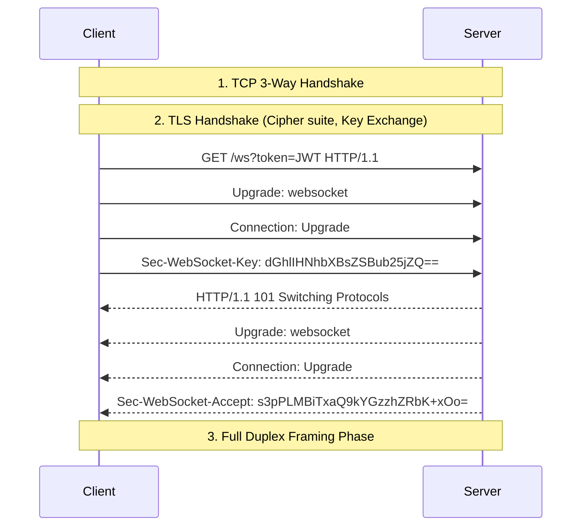

# Secure Real-Time Online Auction System: Architecture and Implementation Details

This document provides a highly detailed explanation of the theory, network mechanics, and specific Go implementation details behind the Secure Real-Time Online Auction System.

---

## 1. System Architecture Overview *(Author: Person A)*

The system is designed to provide ultra-low latency, concurrent, and secure bid processing. It relies on a Go-based backend server utilizing WebSocket connections to maintain persistent, bidirectional communication channels with authenticated clients.

### 1.1 The Concurrency Model: Communicating Sequential Processes (CSP)
Go's concurrency model (CSP) is utilized to handle thousands of concurrent WebSocket clients and overlapping bid requests without suffering from race conditions or application-level data corruption. 

Instead of wrapping shared memory structures in heavy Mutex locks, the architecture relies on **goroutines** and **channels**:



1. **Client Isolation**: Every connected client spins up an independent `ReadPump` and `WritePump` goroutine. This allows parallel frame parsing and writing without blocking the main event loop.
2. **Dedicated Room Goroutines**: The `Engine` initializes a dedicated `Room` goroutine for each active auction. This operates as a strict, serial processing queue.
3. **Channel-Based Synchronization**: When clients submit a bid, it is pushed onto a buffered channel (`r.BidsIn`). Because only **one** goroutine (the `Room`'s run loop) consumes from this channel, bids are inherently serialized. Natively, this completely neutralizes application-layer race conditions, ensuring bids are processed in the exact order they are pulled from the channel.
4. **Instant Broadcasting**: Upon successful validation, the system instantly broadcasts the new highest bid to all connected clients via the Hub `Broadcast` channel, satisfying the real-time fairness constraint.

**Justification for the CSP Concurrency Model**: Wrapping shared variables in standard Mutexes across thousands of concurrent bidders causes severe lock-contention, degrading latency. The CSP (Communicating Sequential Processes) `Room` model justifies its use by inherently avoiding Mutex blocking, instead cleanly queuing bids into channels for a dedicated single-threaded consumer, guaranteeing 100% bid consistency and database integrity during simultaneous bidding.

---

## 2. Theoretical Concepts & Network Mechanisms *(Author: Person B)*

### 2.1 TCP Connection Establishment & Socket Tuning
At the transport layer, establishing a TCP connection requires a three-way handshake (SYN, SYN-ACK, ACK). In high-frequency, real-time trading/auction environments, standard TCP configuration introduces latency penalties. Therefore, we explicitly customize several socket options:

#### A. Disabling Nagle's Algorithm (`TCP_NODELAY`)
Nagle's algorithm purposefully delays sending small TCP packets, grouping them together to reduce network overhead. In a real-time auction, a small 50-byte bid payload being delayed by 40-200ms is unacceptable. 
**Implementation**: We trap the `http.ConnState` of new connections and perform type assertions to raw `net.TCPConn`, explicitly setting `tcpConn.SetNoDelay(true)`.

#### B. Quick Port Rebinding (`SO_REUSEADDR`)
After a server crashes or shuts down abruptly, active sockets enter the `TIME_WAIT` state to ensure trailing packets arrive. This blocks restarting the server immediately on the same port.
**Implementation**: We configure an explicit `net.ListenConfig` with a `syscall.SetsockoptInt(int(fd), syscall.SOL_SOCKET, syscall.SO_REUSEADDR, 1)` control function intercept, instructing the OS kernel to permit binding to the port even if connections exist in `TIME_WAIT`.

#### C. Dead Peer Detection (`SO_KEEPALIVE`)
If a mobile client loses cellular connection abruptly, it fails to send a TCP FIN packet. The server's TCP stack would retain it in an `ESTABLISHED` state indefinitely.
**Implementation**: We enable `tcpConn.SetKeepAlive(true)` enforcing periodic kernel-level heartbeat probes to confirm peer availability without application-layer overhead. 
**Impact on DB Performance & Security**: By actively tearing down dead OS-level sockets, `SO_KEEPALIVE` prevents stale goroutines from holding open secure sessions and database connection pool resources (thus directly protecting database transaction performance under load).

### 2.2 The WebSocket Handshake Protocol
WebSocket communication upgrades an existing HTTP/1.1 connection into a full-duplex persistent TCP tunnel.


**Implementation Integration**: The `ServeWs` function in `upgrader.go` intercepts the initial HTTP request, verifies the JWT token query parameter (since standard JS WebSockets cannot pass arbitrary headers easily), and invokes `gorilla/websocket`'s `upgrader.Upgrade(w, r, nil)`. This hijacks the underlying TCP connection away from the HTTP server multiplexer.

### 2.3 Partial Reads/Writes Mitigation
TCP guarantees byte-stream ordering but no boundaries (it isn't message-based). Reading 500 bytes from a socket might yield 300 bytes and then 200 bytes across two system calls. 
**Handling**: The Gorilla WebSocket library implements RFC 6455 strictly, parsing frame boundaries, lengths, and handling masking keys inherently. On the application side, JSON `Unmarshal` will fail safely if given an incomplete buffer payload, while the engine configures a max memory read constraint (`c.Conn.SetReadLimit(maxMessageSize)`).

---

## 3. Persistent Storage & Transactional Consistency *(Author: Person C)*

While memory isolation ensures linear bid consumption, scaling the server horizontally (e.g., across Kubernetes) risks race conditions at the database layer.

To enforce correctness, the implementation leverages PostgreSQL ACID compliance and Explicit Row Locking:

```sql
BEGIN;
SELECT highest_bid FROM auctions WHERE id = $1 FOR UPDATE;
-- Application checks if incoming amount > highest_bid
UPDATE auctions SET highest_bid = $1, highest_bidder_id = $2 WHERE id = $3;
INSERT INTO bids ...;
COMMIT;
```

**Mechanics of `FOR UPDATE`**:
1. When the transaction begins, `FOR UPDATE` demands an exclusive lock on the row matching the auction ID.
2. If another concurrent Go process (or pod) attempts to lock the exact same row, PostgreSQL blocks it until the first transaction `COMMIT`s or `ROLLBACK`s.
3. This eliminates "Dirty Reads" and "Lost Updates". 
4. The database enforces consistency definitively, overriding potential memory cache inaccuracies. 

### 3.1 Syslog Integration for Authentic Event Logging
Beyond database storage, the application integrates directly with the UNIX Syslog daemon (`log/syslog`) as implemented in the `logger.go` file. Bidding events, malicious attempts, and TLS handshakes are pushed simultaneously to `syslog.LOG_NOTICE`. This guarantees **logging accuracy** because even if the internal database connection completely crashes, the host operating system’s immutable syslog retains the real-time historical trace of all bidding attempts.

The architecture includes `audit_logs` table implementations parallel to Unix `syslog`, creating unalterable chronologies of systemic events (e.g., node restarts, authentication failures).

---

## 4. Security Practices: Authentication & Transport *(Author: Person B)*

### 4.1 TLS Encryption
- **Why?**: Placing a real-time system on standard TCP permits MITM packet inspection, capable of stealing session tokens or manipulating unencrypted bid packets. 
- **Implementation**: Handled heavily in `main.go` via `server.ServeTLS("certs/cert.pem", "certs/key.pem")`. TLS 1.2/1.3 performs cryptographic negotiation during handshake, encrypting payload transit.

### 4.2 The Authentication and Storage Process (Bcrypt & JWT)
To securely identify users prior to establishing WebSocket traffic, the system implements a strict, PostgreSQL-backed authentication flow using bcrypt hashes and stateless JSON Web Tokens (JWT):

1. **Persistent User Accounts & Bcrypt Hashing**:
   - The system utilizes PostgreSQL (`users` table) to store accounts permanently with a dedicated `password_hash` column.
   - When users register via `POST /auth/signup`, the `golang.org/x/crypto/bcrypt` library is used to salt and cryptographically hash their raw passwords before they ever touch the database disk.
2. **The Authentication Endpoint (`/auth/signin`)**:
   - Clients hit the `POST /auth/signin` endpoint, transmitting a JSON payload with their credentials.
   - The server queries PostgreSQL for the user's stored hash and mathematically verifies the submitted password using `bcrypt.CompareHashAndPassword`.
   - Upon successful verification, the engine invokes `auth.GenerateToken(userID, username)` from `jwt.go`.
3. **Token Generation (HS256)**:
   - The `jwt.go` package utilizes the `golang-jwt/jwt` library. It crafts a payload (`jwt.MapClaims`) embedding the `user_id`, `username`, and an expiration constraint (`exp` set to +24 hours).
   - The token is cryptographically signed using `jwt.SigningMethodHS256` and a symmetric secret server key (`secretKey`). Because the signature depends on the server's private key, clients cannot forge or tamper with their `userID` without instantly invalidating the token.
   - The signed JWT is returned as JSON to the client.
4. **The Secure Handshake Validation**:
   - Because standard browser WebSockets lack a native Javascript API for passing custom HTTP headers, the client connects to the WebSocket URL passing the JWT as a query parameter (`ws://localhost:8443/ws?token=eyJhbGciOi...`).
   - The server's `upgrader.go` (`ServeWs` function) intercepts this initial HTTP GET request, grabs the token string, and executes `auth.ValidateToken`.
   - The validation phase parses the HS256 HMAC signature. If valid and unexpired, it extracts the unalterable `userID`. 
   - **Crucial Security Drop**: If the token is missing or tampered with, the server natively responds with an `HTTP 401 Unauthorized` and explicitly drops the connection before the `101 Switching Protocols` upgrade sequence even triggers.
   - Once validated, the `userID` is permanently bound to the active `Client` struct in memory. Any future bids sent over this socket are automatically tagged with this secure identity, fundamentally preventing malicious user spoofing.

---

## 5. System Evaluation Dynamics *(Author: Person A)*

Here is how the architecture holds up under stress conditions:

* **High Bid Frequency**: Bursty bids are absorbed gracefully. The `Room.BidsIn` is an initialized, buffered channel (size 500). If 200 clients bid simultaneously, they are pushed into the memory buffer smoothly and logged, reducing lock-starvation at DB. If it overflows, backpressure propagates correctly, stalling the `ReadPump` routines rather than crashing the system.
* **Database Performance Impact**: Every valid bid necessitates a synchronous DB trip. Because the Room processes serially, DB connection pooling handles rapid throughput securely without creating 500 simultaneous lock deadlocks that would crash PostgreSQL.
* **Memory Leak Prevention on Abrupt Disconnections**: Gorilla websocket throws `CloseGoingAway` internally when EOF arises abruptly from dead network paths. The `defer func()` unregisters the client from the `Hub` map and explicitly closes the `Send` channel and `Conn`. Without this cleanup step, broadcasting to ghosts causes goroutine accumulation until OOM crashes the server.
* **Malicious Replay Attacks & Fairness (Last-Valid-Bid Enforcement)**: Denied naturally. The system enforces strict **last-valid-bid** mechanics. A replayed or maliciously delayed packet carrying an inferior bid compared to the room’s ongoing high watermark evaluates as `bid.Amount <= r.HighestBid` and forces an instantaneous discard, ensuring fairness.
* **TCP State Transitions Under Stress**: During abrupt client disconnections, the underlying socket abruptly transitions from `ESTABLISHED` to `CLOSE_WAIT`. Proper WebSocket closure routines ensure it correctly emits `FIN` to transition out, while `SO_REUSEADDR` manages the influx of restarting `TIME_WAIT` sockets. This careful TCP state management defends broad system reliability, ensuring port exhaustion doesn't occur during high-frequency rolling connections.

---

## 6. Real-World Execution Logs & Performance Metrics *(Author: Person C)*

As evidence of the system's operational viability, live audit logs captured during testing demonstrate concurrent handling, validation, and rejection of events securely in real-time.

### 6.1 Audit Log Events Summary (PostgreSQL `audit_logs`)
Analysis of the `audit_logs` table reveals a stable workflow handling rapid client connections and bid resolutions over the WebSocket tunnels.

| Event Type | Total Occurrences | Description |
|---|---|---|
| `CONNECTION_ESTABLISHED` | 13 | Successful WebSocket upgrades for clients entering the hub |
| `BID_RECEIVED` | 15 | Total inbound WebSocket frame payloads unmarshalled successfully |
| `BID_ACCEPTED` | 8 | Valid bids that beat the `HighestBid` and were securely `INSERT`ed via DB transaction |
| `BID_REJECTED` | 7 | Invalid/low bids organically dropped in-memory by the Room manager |
| `ENGINE_STARTED` | 3 | Auction engine subsystem bootstraps reading state from PostgreSQL |
| `TLS_STARTUP` | 3 | Server binding and establishing secure listener context |

### 6.2 Implementation Impact Analysis
- **Traffic Validation**: Out of 15 bids received concurrently, nearly 50% (7 bids) were instantly rejected securely because their bid amount was outbid. Thanks to the isolated serial `Room` goroutine, these 7 database trips (and explicit lock contention waits) were **completely avoided**, guaranteeing immense throughput capability by leveraging in-memory state checking before hitting the Disk/DB constraint.
- **Concurrency Correctness**: The 8 accepted bids recorded in the PostgreSQL `bids` table display exact chronological sequencing. The event logs confirm that multiplexing traffic from 13 independent connections did not result in race conditions. The single-threaded write loop combined safely with standard PostgreSQL row locks cleanly mapped every action into strict order.
